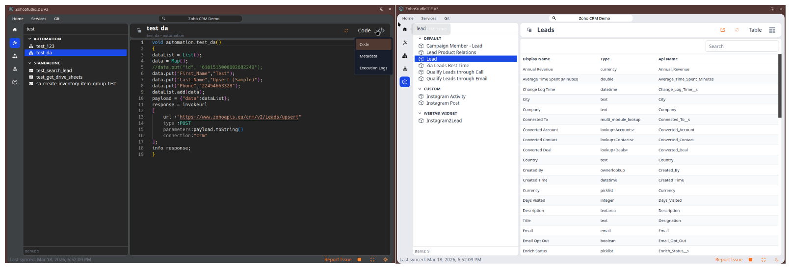

# Zoho Studio Chrome Extension



Zoho Studio is a browser-based development workspace for Zoho services. This repository contains the Chrome extension
application and the shared packages used to inspect, browse, and work with Zoho artifacts from a side panel UI.

The main application lives in [`apps/chrome-ext`](apps/chrome-ext). The current extension runtime registers integrations
for:

- Zoho CRM
- Zoho Creator

## What This Project Does

The extension is designed to work next to an open Zoho tab and expose a development-oriented workspace inside the
browser side panel. Depending on the active integration, it can detect available providers, read metadata, and work with
artifacts through the configured API layer.

At a high level, the project includes:

- a Chrome extension built with Vite, Vue 3, and Manifest V3
- shared core, UI, utility, and export packages in the monorepo
- integration packages for Zoho-related providers
- a configurable HTTP API endpoint used by the extension

## Roadmap And Vision

This extension is actively evolving and is not intended to be a static tool.

The long-term goal is to provide a fast, consistent, and developer-friendly navigation layer across Zoho services,
eliminating the need to manually navigate complex UI structures or rely on ad-hoc scripts.

The focus is on improving the developer experience by:

- enabling quick access to artifacts across different Zoho services
- providing a unified interface for browsing, inspecting, and working with resources
- reducing friction when switching between modules, functions, workflows, and other entities
- expanding support for additional Zoho platforms and capabilities over time

The direction of the project is to become a lightweight developer workspace that lives directly in the browser and
complements the existing Zoho UI rather than replacing it.

New features and improvements are continuously added based on real-world usage and identified pain points.

## Important Notice

This project is an independent tool and is not affiliated with, endorsed by, or supported by Zoho.

It relies on unofficial and undocumented Zoho web APIs and browser behavior. Because of this, some functionality may
change or stop working if Zoho updates its UI or backend.

Use this tool only in environments you are authorized to access and in accordance with your organization's policies.

## 🔒 Security & Accountability

The extension operates only within:

- the Zoho pages opened in your browser
- the API endpoint you explicitly configure
- No Third-Party Backend: This extension does not come with a hosted backend. It is a client-side tool that communicates exclusively with the Zoho tabs open in your browser and the API endpoint you provide in the settings.
- Credential Handling: The extension uses standard browser permissions (cookies, webRequest) to interact with Zoho on your behalf. It does not store your Zoho passwords or persistent session tokens outside of your browser's local storage (IndexedDB).
- Local-First: All crawled metadata and artifacts are stored locally in your browser using Dexie/IndexedDB. No data leaves your machine unless you trigger an "Export" or "Git Commit" action to your own API.

## Functionality

### Core / Architectural Features

The project already includes a number of foundational features at the architecture level:

- modular integration architecture built around integration manifests, where each provider declares its type, display
  name, icon, browser-tab resolver, and supported capabilities
- centralized integration registry in the extension app, allowing providers to be registered and discovered in a
  consistent way
- typed service-provider model in `packages/core` for representing connected Zoho environments, provider metadata, sync
  state, and optional Git binding
- typed artifact model in `packages/core` for storing provider data in a normalized format across capability types such
  as functions, workflows, modules, and fields
- capability-driven design in the core package, so provider-specific logic can plug into a shared abstraction layer
  instead of hardcoding everything into the UI
- browser abstraction layer in `packages/core` for tab discovery, tab watching, cookie access, and HTTP requests
  performed in the context of browser tabs
- dependency injection setup in the extension app through `tsyringe`, which keeps browser services and storage
  implementations replaceable
- local artifact persistence through Dexie/IndexedDB in the Chrome extension, which gives the app an internal cache
  layer for provider artifacts
- app bootstrap based on Vue 3, Pinia, router, and shared plugin registration, keeping the extension shell separate from
  provider-specific logic
- monorepo separation between app code, shared core abstractions, reusable UI kit, utilities, export helpers, and
  provider integrations
- extension-side provider discovery flow that connects the registered integrations with currently open Zoho tabs and
  exposes them in the workspace UI

### Zoho CRM Features

The current `zoho-crm` integration already includes:

- CRM provider detection from supported Zoho CRM browser tabs, including provider identity and title resolution
- capability support for CRM functions, workflows, modules, fields, and webhooks
- artifact loading for CRM functions with detailed data retrieval
- execution logs view for CRM functions inside the artifact details UI
- ZIP export for CRM functions, including metadata JSON and extracted Deluge code
- workflow artifact listing and direct link generation to the related workflow page in Zoho CRM
- ZIP export for workflow artifacts as JSON
- module artifact listing and direct link generation to the related module layouts page in Zoho CRM
- ZIP export for module artifacts as JSON
- field artifact support linked to CRM modules
- ZIP export for field artifacts as JSON
- webhook artifact listing
- webhook details UI with metadata view and failures log view
- direct link generation to the related webhook edit page in Zoho CRM
- ZIP export for webhook artifacts as JSON

### Zoho Creator Features

The current `zoho-creator` integration already includes:

- Creator provider detection from supported Zoho Creator URLs
- form capability support for Zoho Creator apps
- loading of available forms from the current Creator app context
- additional loading of individual form definitions through the Creator application builder endpoints
- artifact details UI for forms with a fields table view
- artifact details UI for forms with a raw definition view
- artifact details UI for forms with a metadata JSON view
- normalized mapping of Creator forms into shared artifact records used by the extension workspace

### Git Features (Beta)

The current Git feature is available in beta form and is intended to support exporting provider artifacts into Git
repositories through the configured API backend.

The current implementation already includes:

- Git user configuration inside the extension UI
- repository registration from the extension UI
- provider artifact export and commit flow into a selected repository
- commit author name and email support
- ZIP-based artifact upload during commit operations

Important:

- this feature is not standalone and requires a backend API
- this repository does not ship a complete Git backend for you
- if you want to use the Git feature, you can implement that backend yourself and connect the extension to it

The frontend currently expects these two backend endpoints:

1. `POST /git/repositories`
   JSON body:
   `{"name":"string","description":"string?","author":{"name":"string","email":"string"}}`
   Expected purpose:
   create or register a Git repository and return a repository object with at least `name`

2. `POST /git/repositories/{repository}/commit`
   Multipart form-data fields:
   `file`, `message`, `repository`, `author[name]`, `author[email]`
   Expected purpose:
   accept the exported ZIP archive, create a commit in the target repository, and return a response with at least
   `message`

If these endpoints are not implemented on your backend, the Git beta functionality in the extension will not work.

## Requirements

- Node.js (version 22 or higher)
- npm
- [nx](https://nx.dev/docs/getting-started/installation) `npm install -g nx`
- Google Chrome or another Chromium-based browser with extension side panel support
- A compatible API application/service available over HTTP

## Configuration

The extension reads its environment variables from `apps/chrome-ext/.env` when run through the Nx targets configured in
this repository.

Use [`apps/chrome-ext/.env.example`](apps/chrome-ext/.env.example) as the template:

```env
VITE_API_BASE_URL=http://127.0.0.1:8000/api
VITE_API_PROXY_TARGET=http://127.0.0.1:8000
VITE_API_HOST_PERMISSION_URL="*://127.0.0.1/*"
VITE_GITHUB_REPO_URL="https://github.com/igor-yuzkiv/zoho-studio"
```

Variable meaning:

- `VITE_API_BASE_URL` - base URL used by the extension for API requests
- `VITE_API_PROXY_TARGET` - proxy target used during local development when the API base URL is relative
- `VITE_API_HOST_PERMISSION_URL` - extra Chrome host permission for your API host
- `VITE_GITHUB_REPO_URL` - repository URL used for issue/report links inside the UI

## Repository Structure

- `apps/chrome-ext` - the main browser extension application
- `packages/core` - integration and capability primitives
- `packages/ui-kit` - shared UI components and styles
- `packages/utils` - shared utility helpers and types
- `packages/export-zip` - ZIP export helpers
- `integrations/*` - provider-specific integration packages

## Installation Guide

### 1. Install Dependencies

From the repository root:

```bash
npm install
```

### 2. Configure The Extension

Create an environment file for the extension:

```bash
cp apps/chrome-ext/.env.example apps/chrome-ext/.env
```

Then edit `apps/chrome-ext/.env` if your API service does not run at the default local address.

### 3. Install Or Start The API Application

This extension expects a compatible HTTP API service. The example configuration assumes:

- API base URL: `http://127.0.0.1:8000/api`
- API host: `http://127.0.0.1:8000`

Before using the extension:

1. Start your API application/service.
2. Confirm it is reachable from the browser.
3. If it runs on a different host, port, or domain, update `apps/chrome-ext/.env`.
4. Rebuild the extension after changing environment values.

If your API is remote, make sure `VITE_API_HOST_PERMISSION_URL` matches that host pattern.

## Build And Run

### Production Build

Build the unpacked extension:

```bash
npx nx build chrome-ext
```

The output is generated in [`apps/chrome-ext/dist`](apps/chrome-ext/dist).

### Development Mode

Start the extension in development mode:

```bash
npx nx dev chrome-ext
```

The local Vite dev server runs on `http://localhost:4201`.

For type-checking:

```bash
npx nx typecheck chrome-ext
```

## Install The Chrome Extension

After building the extension:

1. Open `chrome://extensions/`.
2. Enable **Developer mode**.
3. Click **Load unpacked**.
4. Select the [`apps/chrome-ext/dist`](apps/chrome-ext/dist) directory.
5. Pin the extension if needed.
6. Open any supported Zoho page in another browser tab.
7. Open the extension from the Chrome toolbar or side panel.

When a supported Zoho service is open, it should appear in the extension's service list.

## Typical Local Setup

For a default local workflow:

1. Install dependencies with `npm install`.
2. Copy `apps/chrome-ext/.env.example` to `apps/chrome-ext/.env`.
3. Start your API service on `127.0.0.1:8000`.
4. Run `npx nx build chrome-ext`.
5. Load `apps/chrome-ext/dist` as an unpacked extension in Chrome.
6. Open a Zoho CRM or Zoho Creator page in a browser tab.
7. Open the extension side panel and start working.

## Troubleshooting

- If the extension cannot reach the API, verify `apps/chrome-ext/.env` and confirm the API server is running.
- If a Zoho service does not appear in the UI, make sure the relevant Zoho page is open in another tab.
- If you change environment variables, rebuild the extension before reloading it in Chrome.
- If the unpacked extension does not refresh, reload it from `chrome://extensions/`.
- If Zoho changes its internal behavior, unsupported integrations may need code updates before they work again.
