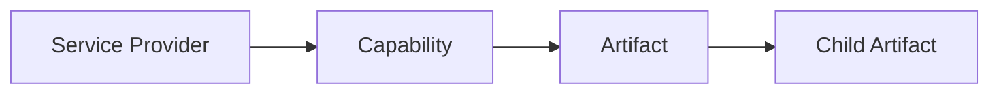

# Domain Model: Provider, Capability, Artifact

## Purpose

This document describes the core domain model used to represent Zoho services and their data.

The model is built around three concepts:

- `ServiceProvider`
- `Capability`
- `Artifact`

## Core Relationship



In short:

- provider = service context
- capability = domain area inside that context
- artifact = normalized data record produced from that domain area

## Core Contracts

### `ServiceProvider`

```ts
type ServiceProvider<TMetadata = Record<string, unknown>> = {
    id: string
    type: string
    title: string
    metadata: TMetadata
    browserTabId?: number | null
    lastSyncedAt?: number
    gitRepository?: string | null
}
```

Role:

- identifies one concrete service context
- scopes capabilities
- scopes artifact ownership

Notes:

- `id` must be stable
- `metadata` should contain only provider-specific context
- one provider represents one sync/storage boundary

### `CapabilityDescriptor`

```ts
type CapabilityType = 'functions' | 'workflows' | 'modules' | 'fields' | 'forms' | 'webhooks' | string

interface CapabilityDescriptor {
    type: CapabilityType
    title: string
    dependsOn?: CapabilityType
    adapter: CapabilityAdapterConstructor
}
```

Role:

- declares a domain area available for a provider
- defines how data for that area is loaded
- may depend on another capability

Examples:

- `modules`
- `fields`
- `functions`
- `forms`

### `ICapabilityAdapter`

```ts
interface ICapabilityAdapter {
    readonly serviceProvider: ServiceProvider
    list?: (pagination: PaginationParams) => PromisePaginatedResult<IArtifact>
    find?: (artifact: IArtifact) => Promise<IArtifact | null>
    findByParent?: (parentArtifact: IArtifact) => Promise<IArtifact[]>
}
```

Role:

- executes capability-specific loading
- maps provider context into artifact output

### `IArtifact`

```ts
interface IArtifact<TCapabilityType extends CapabilityType = CapabilityType, TOrigin = unknown> {
    id: string
    source_id: string
    capability_type: TCapabilityType
    parent_id?: string | null
    provider_id: string
    display_name: string
    api_name?: string | null
    payload: Record<string, unknown>
    origin: TOrigin
}
```

Role:

- normalized record used by the system
- persistent unit for storage and sync
- common format across different Zoho services

## Service Provider

`ServiceProvider` is the root domain object.

It answers:

> Which exact Zoho service context is the system working with?

Examples:

- one CRM organization
- one Creator application

Why it exists:

- Zoho product type alone is too broad
- the system needs a concrete context for sync, capability selection, and data ownership

## Capability

`Capability` represents a loadable domain area inside a provider.

Why it exists:

- providers expose different sets of entities
- loading logic differs by domain
- some domains depend on others

Examples:

- `modules` may be independent
- `fields` may depend on `modules`

Rules:

- capability belongs to a provider type
- capability type should be stable
- use `dependsOn` only for real domain dependencies

## Artifact

`Artifact` is the central data entity.

It is the normalized result of loading provider-specific data through a capability.

Why it is central:

- storage works with artifacts
- sync works with artifacts
- parent-child relations are expressed through artifacts
- different Zoho services become comparable only after mapping into artifacts

Typical artifact contents:

- stable ID
- provider ID
- capability type
- normalized display fields
- typed payload
- original source record

## How They Work Together

Sequence:

1. resolve a `ServiceProvider`
2. get provider `CapabilityDescriptor[]`
3. run the capability adapter
4. map raw service data into `IArtifact`
5. store and query artifacts by provider/capability/parent

Formula:

```text
provider -> capability -> artifact
```

## Artifact Identity

Artifact IDs should be derived from domain context, not only from remote IDs.

Recommended shape:

```text
provider_id + capability_type + domain key
```

Examples:

```text
zoho-crm::<ctx>:modules:Leads
zoho-crm::<ctx>:fields:Leads:Email
```

Why:

- remote IDs may not be globally unique
- child artifacts often need composite IDs
- stable IDs simplify sync and storage

## Why This Model Works

The model solves a few concrete problems:

- one architecture for multiple Zoho services
- provider-specific logic stays isolated
- storage uses one normalized record model
- hierarchical domains fit naturally through `parent_id`
- new domains can be added without redesigning the system

## Extension Rules

### Add a New Provider

Define:

- a new provider type
- a stable provider ID strategy
- typed provider metadata
- the capability set for that provider

Guideline:

- one provider should represent one real service boundary

### Add a New Capability

Define:

- a stable capability type
- its adapter
- whether it depends on another capability
- the artifact family it produces

Guideline:

- create a separate capability only for a distinct domain area

### Add a New Artifact Type

Define:

- normalized fields
- payload shape
- `origin` shape
- ID strategy
- optional `parent_id`

Guideline:

- model domain identity, not transport format

## Safe Extension Checklist

- do not bypass the provider layer
- do not treat raw API responses as system records
- do not mix unrelated concepts into one capability
- do not use unstable IDs
- do not encode hierarchy outside artifact relationships

## Summary

The domain model is intentionally small:

- `ServiceProvider` defines context
- `Capability` defines behavior
- `Artifact` defines normalized data

That separation is what makes the system extensible without breaking existing integrations.
