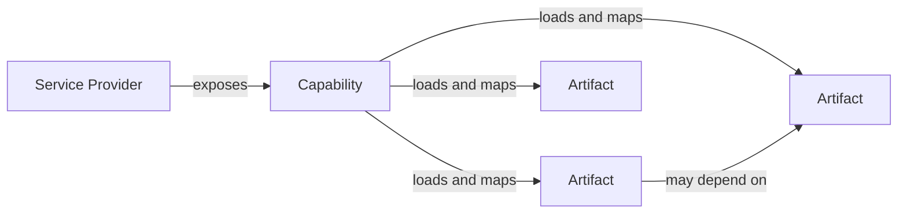

# Domain Model: Service Providers, Capabilities, and Artifacts

## Purpose

This document explains the core domain model used by the system to represent supported Zoho services and the data loaded from them.

It focuses on three central concepts:

- **service provider**
- **capability**
- **artifact**

These concepts form the stable domain layer of the project. They are used to describe different Zoho products through a shared model, so the system can grow without introducing a separate architecture for each service.

## Why This Model Exists

Zoho products expose different kinds of entities, different naming conventions, and different ways of loading data. Without a shared domain model, each supported product would require its own isolated flow, its own storage model, and its own handling rules.

The domain model exists to solve that problem.

It provides:

- a common way to represent a concrete Zoho context
- a common way to describe what can be loaded from that context
- a common way to store and work with the loaded data

The result is a system where product-specific behavior stays local to an integration, while the rest of the application can work with a unified vocabulary.

## Domain Overview

At the highest level, the relationship is:



The same model can describe very different domains:

- a CRM organization that exposes modules, fields, functions, workflows, and webhooks
- a Creator application that exposes forms
- a future provider that may expose reports, pages, schedules, or any other product-specific entities

## Core Type Shapes

The domain model is intentionally expressed through a small set of generic contracts.

### `ServiceProvider`

```ts
type ServiceProviderId = string

type ServiceProviderType =
    | 'zoho-crm'
    | 'zoho-finance'
    | 'zoho-creator'
    | 'zoho-recruit'

type ServiceProvider<TMetadata = Record<string, unknown>> = {
    id: ServiceProviderId
    type: ServiceProviderType
    title: string
    metadata: TMetadata
    browserTabId?: number | null
    lastSyncedAt?: number
    gitRepository?: string | null
}
```

Important domain observations:

- `TMetadata` is generic because each provider type needs a different context shape.
- `id` is the stable domain identity of the provider.
- `type` selects the provider family and therefore the integration manifest.
- `metadata` carries provider-specific context needed by capabilities and mappers.
- `lastSyncedAt` supports provider-scoped synchronization policies.

### `IIntegrationManifest`

```ts
interface IIntegrationManifest {
    serviceProviderType: ServiceProviderType
    displayName: string
    icon: string
    resolveFromBrowserTab: ServiceProviderFromBrowserTabResolver
    capabilities: CapabilityDescriptor[]
}
```

At the domain level, the important part is not the UI metadata. The critical point is that one provider type resolves to one manifest, and that manifest declares the capability set for that provider family.

### `CapabilityDescriptor`

```ts
type CapabilityType =
    | 'functions'
    | 'workflows'
    | 'modules'
    | 'fields'
    | 'forms'
    | 'webhooks'
    | string

interface CapabilityDescriptor {
    type: CapabilityType
    title: string
    icon: string
    hideInMenu?: boolean
    dependsOn?: CapabilityType
    adapter: CapabilityAdapterConstructor
    toExportZip?: (artifact: IArtifact) => ExportZipItem[]
    getArtifactServiceUrl?: (provider: ServiceProvider, artifact: IArtifact) => string | null | undefined
    artifactDetailViewSettings?: Partial<ArtifactDetailViewConfig>
}
```

From a domain perspective:

- `type` is the stable identity of the capability domain.
- `dependsOn` expresses domain ordering between capability sets.
- `adapter` is the loading boundary between provider context and artifact production.
- the remaining hooks extend behavior around artifacts, but they do not change the core model.

### `ICapabilityAdapter`

```ts
interface ICapabilityAdapter {
    readonly serviceProvider: ServiceProvider
    find?: (artifact: IArtifact) => Promise<IArtifact | null>
    findByParent?: (parentArtifact: IArtifact) => Promise<IArtifact[]>
    list?: (pagination: PaginationParams) => PromisePaginatedResult<IArtifact>
}
```

This interface is the operational form of a capability.

It matters because it keeps loading rules attached to capability semantics instead of scattering them across unrelated services.

### `IArtifact`

```ts
type ArtifactId = string

type ArtifactPayloadMap = {
    functions: FunctionArtifactPayload
    workflows: WorkflowArtifactPayload
    modules: ModuleArtifactPayload
    fields: FieldArtifactPayload
    [key: string]: Record<string, unknown>
}

interface IArtifact<
    TCapabilityType extends CapabilityType = CapabilityType,
    TOrigin extends IEntity = IEntity,
> extends IEntity {
    id: ArtifactId
    source_id: string
    capability_type: TCapabilityType
    parent_id?: ArtifactId | null
    provider_id: ServiceProviderId
    display_name: string
    api_name?: string | null
    payload: ArtifactPayloadMap[TCapabilityType]
    origin: TOrigin
}
```

Important technical consequences:

- `IArtifact` is generic over both capability type and original source type.
- `payload` is typed through `ArtifactPayloadMap`, which keeps capability-specific payloads explicit.
- `origin` preserves the raw source entity, while `payload` provides the normalized domain view.
- `parent_id` expresses hierarchical relationships without changing the record model itself.

### `IArtifactsStorage`

```ts
interface IArtifactsStorage {
    bulkUpsert(artifacts: IArtifact[]): Promise<boolean>
    updateById(id: string, artifact: Partial<IArtifact>): Promise<boolean>
    findById<T extends CapabilityType = CapabilityType>(id: string): Promise<IArtifact<T> | null>
    findByProviderId<T extends CapabilityType = CapabilityType>(providerId: string): Promise<IArtifact<T>[]>
    findByParentId<T extends CapabilityType = CapabilityType>(parentId: string): Promise<IArtifact<T>[]>
    findByProviderIdAndCapabilityType<T extends CapabilityType = CapabilityType>(
        providerId: string,
        capabilityType: string
    ): Promise<IArtifact<T>[]>
    countByProviderId(providerId: string): Promise<number>
    deleteByProviderId(providerId: string): Promise<number>
}
```

This interface is worth noting because storage is artifact-centric, not provider-payload-centric. That is one of the strongest signals that artifact is the main persistent unit in the domain.

## Service Provider

### What It Is

A service provider is the domain representation of one concrete Zoho service context.

Conceptually, it answers the question:

> "What exact service instance is the system currently working with?"

Examples:

- one specific Zoho CRM organization
- one specific Zoho Creator application
- one future Zoho product account or workspace

It is not a generic product type. It is a concrete runtime instance of that product in a specific context.

### Role in the Domain Model

The service provider is the domain root for all provider-specific work.

It gives the system:

- a stable provider identity
- a provider type
- provider metadata needed to understand the service context
- the boundary within which capabilities and artifacts are interpreted

Without a provider, the system does not know:

- which Zoho product it is talking to
- which capabilities are valid
- which loaded records belong together

This is why the provider acts as the anchor for the rest of the model.

### Why the Model Uses a Provider Layer

The provider layer exists because "Zoho CRM" or "Zoho Creator" alone is too broad to be useful at runtime.

The system needs a concrete domain object that can represent:

- one identifiable service context
- one unit of synchronization
- one boundary for storage and refresh
- one source for capability selection

This avoids mixing together data from different service instances and allows the rest of the domain model to remain explicit.

### Technical Notes

- The provider type is open to multiple families, but each concrete provider instance still resolves to exactly one `ServiceProviderType`.
- Provider metadata should be treated as typed domain context, not as an unstructured dump of remote state.
- A provider should expose enough metadata to support capability execution and artifact mapping, but not so much that provider identity becomes unstable.

## Capability

### What It Is

A capability is a domain-level description of something the system knows how to load, interpret, and expose for a provider.

Examples include:

- functions
- workflows
- modules
- fields
- forms
- webhooks

A capability is not the data itself. It is the definition of a data domain and the rules for working with it.

### Why Capability Exists

Different providers do not expose the same kinds of entities. Even when two providers expose conceptually similar entities, they may require different loading logic and different mapping rules.

The capability abstraction exists to separate these concerns:

- the provider says what service context exists
- the capability says what domain area is available inside that context
- the artifact represents the normalized result of loading that domain area

This makes the model extensible. New provider features can be added by introducing new capabilities instead of changing the entire domain structure.

### Relationship Between Capability and Provider

Capabilities are attached to a provider type, not to the entire system globally.

This means:

- a provider declares which capabilities it supports
- capability behavior is interpreted within the provider context
- the same capability name can be used consistently across providers when it represents the same domain idea
- provider-specific differences stay inside the capability implementation and mapping rules

In other words, a capability is meaningful only in relation to a provider.

For example:

- "fields" are meaningful only if the provider exposes some parent entity that contains fields
- "forms" are meaningful only for providers where forms exist as a domain concept
- "functions" may exist in multiple products, but their origin format and loading rules may differ by provider

### Capability Dependencies

Some capabilities are independent and can load directly from the provider.

Others depend on artifacts produced by another capability.

Typical example:

- a provider loads **modules** first
- the **fields** capability then uses those module artifacts as parent context

This dependency model is important because it keeps relationships explicit inside the domain instead of hiding them in ad hoc fetching logic.

### Technical Notes

- `CapabilityType` is intentionally open-ended through `| string`, which allows new capability domains without redesigning the base abstraction.
- The capability contract assumes that loading behavior is implemented through an adapter and not embedded directly into the provider object.
- `dependsOn` should be used only for true domain dependencies, not for convenience ordering.

## Artifact

### What It Is

An artifact is the normalized domain record produced when capability-specific data is loaded from a provider.

If the provider is the context and the capability is the rule set, the artifact is the actual working unit of data.

Examples:

- one CRM module
- one field belonging to a module
- one workflow
- one function
- one Creator form

### Why Artifact Is Central

Artifact is the central entity because it is the point where product-specific data becomes system-level data.

Before mapping, the system deals with service-specific payloads and naming.
After mapping, the system deals with artifacts.

This is the key boundary in the domain model.

Once data is represented as artifacts, the rest of the system can treat it in a unified way:

- identify it
- group it by provider
- group it by capability
- store it
- refresh it
- relate it to parent or child artifacts
- expose it to higher layers as a stable data model

### What an Artifact Represents

At a conceptual level, an artifact contains:

- a stable identity
- the provider it belongs to
- the capability domain it belongs to
- optional parent linkage
- normalized display data
- domain-specific payload
- original source data

This combination is important.

The normalized fields make artifacts usable across the system, while the payload and original data preserve domain meaning and provider-specific detail.

### Why the Model Uses Artifacts Instead of Raw Provider Data

Using raw provider responses directly would tightly couple the entire system to Zoho-specific response shapes.

That would create several problems:

- storage would become inconsistent across providers
- relationships between records would be harder to express
- higher layers would need provider-specific branching logic
- adding new integrations would require touching unrelated parts of the system

Artifacts solve this by acting as the translation boundary between provider-specific data and shared system behavior.

### Artifact Identity

Artifact identity is built from domain context, not just from remote source IDs.

Conceptually, artifact IDs follow this structure:

```text
artifact_id = provider_id + capability_type + domain-specific key parts
```

That design matters because:

- source IDs may not be globally unique across providers
- some artifact types need composite identities
- identity must remain stable across sync cycles

A typical example is:

```text
zoho-crm::<provider-context>:modules:Leads
zoho-crm::<provider-context>:fields:Leads:Email
```

This makes parent-child relations and storage boundaries deterministic.

### Typed Payloads

Artifacts do not all share the same payload shape. The model keeps payload typing capability-specific.

Examples:

```ts
type FunctionArtifactPayload = {
    type: 'button' | 'standalone' | 'dynamic' | 'automation' | 'scheduler' | 'unknown'
    display_name?: string | null
    script?: string | null
    params?: { name: string; type: string }[] | null
}

type WorkflowArtifactPayload = {
    module_api_name: string | null
    module_display_name: string | null
}

type ModuleArtifactPayload = {
    api_supported: boolean
    module_type: string | null
    module_name: string
}

type FieldArtifactPayload = {
    parent_module_name: string
    data_type: string
    display_data_type: string
}
```

This is a good example of the model's balance:

- artifacts are unified structurally
- payloads remain specialized semantically

## How Provider, Capability, and Artifact Work Together

The interaction between the three concepts can be read as a sequence:

1. A **service provider** defines the concrete service context.
2. The provider exposes one or more **capabilities**.
3. Each capability knows how to load one domain area for that provider.
4. The capability maps the loaded provider-specific data into **artifacts**.
5. Artifacts become the shared representation used by the rest of the system.

This can be summarized as:

```text
provider = where the system works
capability = what domain area it can work with
artifact = what data unit it produces
```

## Parent-Child Relationships

The model also supports hierarchical artifact relationships.

This is necessary for domains where one entity is naturally scoped by another.

Examples:

- a field belongs to a module
- a child resource may belong to a parent workflow or parent form

The model treats this as an artifact-to-artifact relationship rather than as a provider-specific special case. That keeps the structure generic and reusable.

Technically, this is represented through `parent_id` on the child artifact, not through a separate record type for each hierarchy.

## How the Model Unifies Different Zoho Services

The domain model does not attempt to force all Zoho products into the same raw structure.

Instead, it normalizes them at the right level:

- all supported services can be represented as providers
- all loadable domain areas can be represented as capabilities
- all loaded records can be represented as artifacts

This is the main unification strategy.

It means the system can support multiple Zoho services without pretending they are identical. The model preserves product differences where they matter, but gives the rest of the system stable abstractions.

For example:

- CRM and Creator are different products
- they expose different capabilities
- they return different source data
- but both still fit the same provider-capability-artifact model

## Principles Behind the Model

Several design principles are built into this structure.

### 1. Explicit Context

All domain work happens inside a provider context.

This prevents ambiguous data handling and keeps synchronization, storage, and identity scoped to a known service instance.

### 2. Separation of Concerns

The three concepts have distinct responsibilities:

- provider owns context
- capability owns domain behavior
- artifact owns normalized data

This keeps the model readable and extensible.

### 3. Normalization at the Domain Boundary

Raw service data is translated into artifacts early.

That reduces the spread of provider-specific formats into the rest of the system.

### 4. Extensibility Through Composition

New services are added by defining new providers.
New domain areas are added by defining new capabilities.
New data shapes are added by defining new artifact mappings.

The system grows by composition instead of branching special cases across the whole codebase.

### 5. Stable Identity

Artifacts and providers use stable identities that can be reconstructed consistently from domain data.

This is important for synchronization, deduplication, parent-child relations, and persistence.

### 6. Support for Dependency-Aware Domains

Not all domains are flat.

The model supports capabilities that depend on artifacts from other capabilities, which allows hierarchical Zoho structures to fit naturally into the same architecture.

## What Problems This Model Solves

This domain model addresses several concrete problems:

- representing multiple Zoho services without duplicating architecture
- isolating provider-specific logic from shared workflows
- loading heterogeneous data through one conceptual mechanism
- storing different domain entities through one normalized record type
- expressing parent-child relations without bespoke handling for each service
- making it possible to extend the system incrementally

## Practical Extension Guide

This section describes how to extend the domain model without breaking its core assumptions.

### Add a New Service Provider

To add a new service provider, define a new provider type that represents one concrete service context.

At the domain level, this means:

1. Decide what the provider instance represents.
2. Define the metadata required to identify and work with that instance.
3. Define how the system recognizes this provider from the external service context.
4. Assign the set of capabilities that belong to this provider type.

Good provider design usually follows these rules:

- the provider should represent one stable service boundary
- the provider identity should be deterministic
- the provider metadata should contain only what is needed to interpret the domain context

Avoid creating providers that are too broad. If one provider instance can contain unrelated service contexts, artifact ownership and capability meaning become unclear.

Technical checklist:

- define a unique `ServiceProviderType`
- define a typed metadata shape for the provider
- define deterministic provider ID construction
- register exactly one integration manifest for that provider type
- attach only the capabilities that are valid for that provider family

### Attach New Capabilities to a Provider

After defining the provider, add capabilities that represent the domain areas that can be loaded from it.

For each capability, define:

- its domain meaning
- whether it is independent or depends on another capability
- what kind of artifacts it produces
- what stable identifiers its artifacts should use

When deciding whether something should be a separate capability, ask:

- does it represent a distinct domain area?
- can it be loaded and reasoned about separately?
- does it produce its own artifact set?

If the answer is yes, it is usually a capability.

Technical checklist:

- choose a stable `CapabilityType`
- define the capability descriptor
- implement an adapter that can `list`, and optionally `find` or `findByParent`
- declare `dependsOn` only if the capability consumes parent artifacts

### Define New Artifact Types

When a capability introduces a new kind of domain entity, define a corresponding artifact type.

At a conceptual level, this means:

- choose a capability name that identifies the domain
- define the normalized fields that all artifacts of this type should expose
- define the payload structure that preserves domain-specific meaning
- define how raw provider data maps into the artifact shape

Artifact types should be designed around domain identity, not around transport format.

For example, a "report" artifact should represent a report as a domain object, not a copy of whatever remote response happened to return it.

Technical checklist:

- extend the capability-to-payload mapping with the new payload type
- decide what `IArtifact<'new-type'>` should expose as normalized fields
- define how `origin` should be typed for that artifact family
- decide whether the artifact needs `parent_id`
- ensure IDs are stable across sync runs

### Map Provider Data Into Artifacts

The mapping step is where extension quality is decided.

A good mapping should:

- produce stable artifact IDs
- preserve provider ownership
- assign the correct capability type
- create parent-child links when the domain requires them
- normalize names and key fields for consistent handling
- keep the original source data available when domain-specific detail matters

The purpose of mapping is not only to transform data. It is to place provider-specific records into the shared domain model.

A useful mental model is:

```text
remote entity -> provider-aware mapping -> typed artifact
```

If the mapping step cannot clearly answer which provider owns the record, which capability produced it, and what its stable ID is, the artifact definition is probably incomplete.

### Preserve the Existing Domain Model

When extending the system, the main goal is not just to make new data load. The goal is to make new data fit the model cleanly.

Use these rules:

- do not bypass the provider layer for provider-specific data
- do not treat raw service responses as first-class system records
- do not encode capability-specific logic into unrelated domains
- do not overload one capability with several unrelated concepts
- do not create artifact IDs that depend on unstable runtime details

If a new requirement does not fit the existing model, first check whether it should be:

- a new provider type
- a new capability
- a new artifact type
- a parent-child relationship between existing artifacts

Only after that should the model itself be reconsidered.

### Conceptual Example

Assume you want to support a new Zoho product that exposes:

- environments
- scripts inside each environment
- triggers attached to scripts

A clean domain extension would be:

- model the product instance as a **service provider**
- model **environments** and **scripts** as capabilities if both are first-class loadable domains
- model **triggers** as a dependent capability if they only make sense in relation to scripts
- map each loaded record into artifacts with stable provider ownership and parent relationships

That keeps the extension aligned with the existing model:

- provider defines context
- capability defines domain behavior
- artifact defines normalized data

In technical terms, the extension would likely introduce:

- one new `ServiceProviderType`
- one new typed provider metadata shape
- one new integration manifest
- two or three new `CapabilityType` values
- new payload entries in `ArtifactPayloadMap`
- new `IArtifact<'capability-type', TOrigin>` mappings for each domain entity

## Summary

The domain model is built around a simple but strict structure:

- a **service provider** defines the concrete service context
- a **capability** defines what domain area can be loaded for that context
- an **artifact** is the normalized unit of data produced from that domain area

This structure is intentionally narrow. Its value comes from forcing different Zoho services to enter the system through the same conceptual boundaries.

That is what makes the model extensible, predictable, and suitable for adding new providers, capabilities, and artifact types without rewriting the rest of the system.
