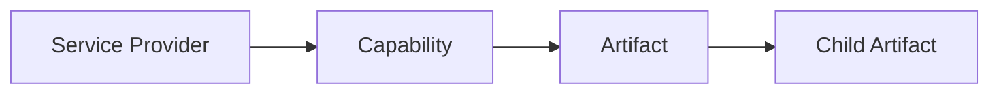

# Zoho Studio Extension: General Overview

## Purpose

Zoho Studio is a browser extension that adds a developer-focused workspace next to active Zoho pages. Its job is to detect supported Zoho services already open in the browser, identify the current service context, load service metadata and artifacts, and present them in a consistent UI.

The extension does not replace Zoho pages. It works alongside them and uses the active browser session as its execution context.

## Core Runtime Model

At a high level, the system is built around four concepts:

- **Browser tabs**: open tabs are the runtime entry point. A supported Zoho tab provides both context and authenticated browser state.
- **Providers**: a provider represents one concrete Zoho service context discovered from a tab, such as a specific CRM organization or a specific Creator application.
- **Integrations**: an integration defines how a Zoho product is recognized and how data should be loaded for it.
- **Capabilities**: a capability represents a functional area of a provider, such as functions, workflows, modules, fields, forms, or webhooks.

This model lets the extension treat different Zoho products through a shared workflow while keeping product-specific logic isolated behind integrations and capabilities.

## Working With Active Zoho Tabs

The extension continuously observes browser tabs and evaluates them against the set of supported integrations.

For each open tab:

1. The extension checks whether the URL matches a known Zoho product.
2. If the tab matches, the integration extracts service-specific metadata from the URL.
3. That metadata is normalized into a provider identity.
4. The provider is associated with the current browser tab and becomes available in the extension UI.

This means the extension does not require a manual connection step. A provider appears when a supported Zoho page is open in the browser.

A provider can be considered:

- **Online** when its corresponding browser tab is currently available.
- **Offline** when the tab is closed or no longer matched, while its previously cached data may still remain available locally.

## Access to Tabs, Cookies, and HTTP Requests

The extension separates browser access into three responsibilities:

- **Tab access** is used to enumerate open tabs, detect supported Zoho contexts, and keep provider-to-tab associations current.
- **Cookie access** is used to read the authenticated browser session for the matched Zoho tab. This allows the extension to reuse the user session already established in the browser.
- **HTTP access** is performed in the context of the matched Zoho tab rather than as an isolated external client. Conceptually, the extension asks the browser to execute requests as if they originated from the active Zoho page context.

This design is important for two reasons:

- it keeps the extension aligned with the authenticated session already present in the browser
- it avoids treating Zoho APIs as a separate login flow managed by the extension itself

Where a Zoho product requires request signing or anti-CSRF values, the integration derives those values from the active browser session before issuing requests.

## Lifecycle

The runtime lifecycle follows a consistent sequence:

### 1. Startup

When the side panel application starts, it initializes its browser services, local stores, and persistent cache access. It also restores previously known providers from local state so the workspace can show known contexts immediately.

### 2. Provider Detection

The extension reads the current browser tabs and watches for future tab updates. Each supported integration attempts to resolve providers from the available Zoho tabs.

### 3. Data Loading

Once a provider is available and considered online, the extension can load its capabilities. Each capability fetches domain-specific data from Zoho and maps it into a shared artifact model used by the UI and local storage.

### 4. Interaction

Users interact with normalized provider data through the extension workspace rather than through raw Zoho responses. They can browse providers, inspect artifacts, switch between capability views, and trigger refresh or export-style actions.

### 5. Refresh and Re-Sync

Cached provider data is refreshed when it is missing, stale, or explicitly invalidated by the user. Refresh clears or replaces outdated local records and re-fetches current data from the active Zoho context.

## Data Movement

The main data flow is:

1. **Browser** exposes the currently open tabs and browser session state.
2. **Extension runtime** identifies supported Zoho tabs and resolves them into providers.
3. **Integration layer** uses the matched tab context to access Zoho endpoints.
4. **Capability layer** transforms Zoho-specific responses into normalized artifacts.
5. **Local storage** persists those artifacts for later reuse.
6. **UI layer** reads normalized artifacts from local state and renders provider and capability views.

In practice, this creates a local-first loop:

- Zoho pages provide context and authenticated access.
- The extension fetches and normalizes data.
- IndexedDB stores the normalized result.
- The UI reads from local storage and refreshes from Zoho when needed.

## Local Storage and Caching

IndexedDB is used as the extension's primary local persistence layer.

Its role is to store normalized artifacts by provider and capability so that:

- previously fetched data can be reopened without reloading everything immediately
- the workspace can continue to show known providers and artifacts between sessions
- refresh logic can compare cached state with expected freshness rules
- dependent capability data can be loaded in phases and merged into one local dataset

The cache is provider-scoped. Each provider maintains its own local artifact set and sync timestamp. This makes it possible to refresh one provider independently without affecting others.

Caching is treated as a runtime optimization, not as the source of truth. The source of truth remains the current Zoho service state reachable through an active matched tab.

## Domain Model

The core domain model is built around three concepts:

- `ServiceProvider`
- `Capability`
- `Artifact`



In short:

- provider = service context
- capability = domain area inside that context
- artifact = normalized data record produced from that domain area

## Integrations and Providers

An integration describes how the system supports one Zoho product family.

At the conceptual level, an integration is responsible for:

- recognizing whether a browser tab belongs to that product
- extracting provider metadata from the tab context
- defining which capabilities are available for that provider type
- supplying product-specific rules for data loading and interaction

A provider is the concrete runtime instance produced by an integration. It represents a single service context that the rest of the system can work with uniformly.

This separation allows the extension to scale by adding new integrations without changing the overall runtime model.

### `ServiceProvider`

```ts
type ServiceProvider<TMetadata = Record<string, unknown>> = {
    id: string
    type: string
    title: string
    metadata: TMetadata
    browserTabId?: number | null
    lastSyncedAt?: number
    gitRepository?: string | null
}
```

Role:

- identifies one concrete service context
- scopes capabilities
- scopes artifact ownership

Notes:

- `id` must be stable
- `metadata` should contain only provider-specific context
- one provider represents one sync/storage boundary

`ServiceProvider` is the root domain object. It answers:

> Which exact Zoho service context is the system working with?

Examples:

- one CRM organization
- one Creator application

Why it exists:

- Zoho product type alone is too broad
- the system needs a concrete context for sync, capability selection, and data ownership

## Capability System

Capabilities are the main way the extension models what can be loaded or inspected from a provider.

Examples of capability domains include:

- functions
- workflows
- modules
- fields
- forms
- webhooks

Each capability defines:

- its identity and display metadata
- how data for that domain is fetched
- whether it depends on another capability
- how its artifacts are interpreted for UI or export workflows

This allows the system to represent heterogeneous Zoho concepts through one shared abstraction.

### `CapabilityDescriptor`

```ts
type CapabilityType = 'functions' | 'workflows' | 'modules' | 'fields' | 'forms' | 'webhooks' | string

interface CapabilityDescriptor {
    type: CapabilityType
    title: string
    dependsOn?: CapabilityType
    adapter: CapabilityAdapterConstructor
}
```

Role:

- declares a domain area available for a provider
- defines how data for that area is loaded
- may depend on another capability

Examples:

- `modules`
- `fields`
- `functions`
- `forms`

### `ICapabilityAdapter`

```ts
interface ICapabilityAdapter {
    readonly serviceProvider: ServiceProvider
    list?: (pagination: PaginationParams) => PromisePaginatedResult<IArtifact>
    find?: (artifact: IArtifact) => Promise<IArtifact | null>
    findByParent?: (parentArtifact: IArtifact) => Promise<IArtifact[]>
}
```

Role:

- executes capability-specific loading
- maps provider context into artifact output

### Capability Dependencies

Not all capabilities are independent. Some depend on artifacts loaded by another capability.

For example, a capability may require parent entities to be known before child entities can be loaded. The system therefore supports phased synchronization:

- independent capabilities load first
- dependent capabilities load after their prerequisites are available

This keeps the loading process predictable while preserving a generic runtime model.

`Capability` represents a loadable domain area inside a provider.

Why it exists:

- providers expose different sets of entities
- loading logic differs by domain
- some domains depend on others

Rules:

- capability belongs to a provider type
- capability type should be stable
- use `dependsOn` only for real domain dependencies

## Artifact Representation

Capability data is normalized into shared artifact records.

An artifact is the extension's common representation of a single unit of provider data. At a conceptual level, an artifact contains:

- a stable identity
- a provider association
- a capability type
- optional parent-child linkage
- normalized display fields
- the original service payload or origin data

This representation is important because it gives the rest of the system a common language for storage, browsing, refresh, export, and detail views across different Zoho products.

### `IArtifact`

```ts
interface IArtifact<TCapabilityType extends CapabilityType = CapabilityType, TOrigin = unknown> {
    id: string
    source_id: string
    capability_type: TCapabilityType
    parent_id?: string | null
    provider_id: string
    display_name: string
    api_name?: string | null
    payload: Record<string, unknown>
    origin: TOrigin
}
```

Role:

- normalized record used by the system
- persistent unit for storage and sync
- common format across different Zoho services

`Artifact` is the central data entity.

It is the normalized result of loading provider-specific data through a capability.

Why it is central:

- storage works with artifacts
- sync works with artifacts
- parent-child relations are expressed through artifacts
- different Zoho services become comparable only after mapping into artifacts

Typical artifact contents:

- stable ID
- provider ID
- capability type
- normalized display fields
- typed payload
- original source record

## How They Work Together

Sequence:

1. resolve a `ServiceProvider`
2. get provider `CapabilityDescriptor[]`
3. run the capability adapter
4. map raw service data into `IArtifact`
5. store and query artifacts by provider, capability, and parent

Formula:

```text
provider -> capability -> artifact
```

## Artifact Identity

Artifact IDs should be derived from domain context, not only from remote IDs.

Recommended shape:

```text
provider_id + capability_type + domain key
```

Examples:

```text
zoho-crm::<ctx>:modules:Leads
zoho-crm::<ctx>:fields:Leads:Email
```

Why:

- remote IDs may not be globally unique
- child artifacts often need composite IDs
- stable IDs simplify sync and storage

## Summary

The extension operates as a local browser-side runtime that:

- discovers supported Zoho contexts from open tabs
- resolves them into providers
- loads provider data through integration-defined capabilities
- normalizes that data into shared artifacts
- stores artifacts locally in IndexedDB
- presents a consistent developer workspace with refreshable cached state

The result is a system where tabs provide live context, integrations provide product knowledge, capabilities provide domain behavior, artifacts provide the shared storage model, and local storage provides continuity between interactions.
