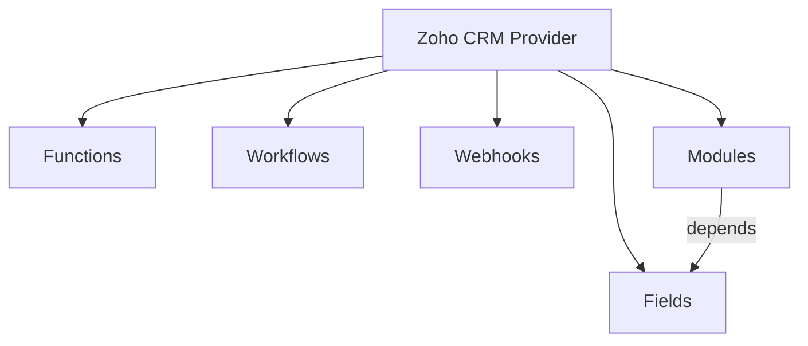

# Zoho CRM Integration

## Purpose

This document describes the `zoho-crm` integration at a high level: what it supports, which CRM domains it exposes, and which implementation constraints matter when extending or maintaining it.

## What This Integration Represents

The Zoho CRM integration maps one concrete CRM context into a `ServiceProvider` of type `zoho-crm`.

The provider metadata is:

```ts
type CrmServiceProviderMetadata = {
    host: string
    orgId: string
    isSandbox: boolean
}
```

Provider identity is organization-scoped:

- regular CRM: `zoho-crm::<orgId>`
- sandbox CRM: `zoho-crm::sandbox::<orgId>`

This keeps production and sandbox contexts separate even when they belong to the same logical organization.

## Provider Detection

The integration detects CRM providers from the active tab URL.

Supported URL families:

- regular CRM hosts such as `https://crm.zoho.<tld>/crm/org<orgId>/...`
- sandbox hosts such as `https://crmsandbox.zoho.<tld>/crm/<orgId>/...`

Detection result:

- extract `host`
- extract `orgId`
- detect sandbox vs regular
- create a provider title like `Zoho CRM (<orgId>)` or `Zoho CRM Sandbox (<orgId>)`

Implication:

- the integration is tied to an active CRM browser tab
- if no matching tab exists, the provider cannot operate online

## Request Model

All CRM requests are executed in the context of the active CRM tab.

The integration relies on:

- the current browser session
- CRM cookies
- CSRF token from `CT_CSRF_TOKEN`
- request headers such as `x-zcsrf-token` and `x-crm-org`

Practical consequence:

- the integration does not manage an independent auth flow
- requests fail if the CRM tab is not available or the required session cookies are missing

## Supported Capabilities

The integration currently exposes:

- `functions`
- `workflows`
- `webhooks`
- `modules`
- `fields`

Relationship overview:



## Capability Details

### Functions

Main purpose:

- list CRM functions
- load detailed function definition
- expose script source and metadata
- expose execution logs

Artifact shape:

- capability type: `functions`
- stable ID: `provider_id + functions + function.id`
- payload includes function type, script, and display name

Main behavior:

- the integration first lists functions
- it then loads function details per item to enrich the final artifact set
- log endpoints are supported for operational inspection

Export behavior:

- exports a folder per function
- includes metadata JSON
- includes Deluge script file

Nuances:

- function names are normalized before becoming `display_name`
- if CRM returns incomplete list data, the detail-loading step is what makes artifacts useful
- capability quality depends on the details endpoint, not only the list endpoint

### Workflows

Main purpose:

- list CRM workflow rules
- normalize workflow metadata into artifacts
- provide direct service URL for jumping back to CRM

Artifact shape:

- capability type: `workflows`
- stable ID: `provider_id + workflows + workflow.id`
- payload includes module references

Export behavior:

- exports workflow origin as JSON

Nuances:

- workflow artifacts are mostly metadata-oriented
- this capability does not currently model child workflow entities as separate artifacts
- workflow URLs are derived from provider metadata and workflow source ID

### Webhooks

Main purpose:

- list CRM webhooks
- expose module association and target URL
- inspect failure log data

Artifact shape:

- capability type: `webhooks`
- stable ID: `provider_id + webhooks + webhook.id`
- payload includes module identity, HTTP method, feature type, target URL, and association flag

Additional behavior:

- supports webhook failure log retrieval
- provides direct service URL for editing a webhook in CRM

Export behavior:

- exports webhook origin as JSON

Nuances:

- webhook module context may come from either `module` or `related_module`
- failure log endpoint may return `204 No Content`, which is treated as an empty successful result
- this capability is both configuration-oriented and operational because it exposes failures, not only metadata

### Modules

Main purpose:

- list CRM modules
- expose module metadata needed by the rest of the integration
- act as the parent domain for `fields`

Artifact shape:

- capability type: `modules`
- stable ID: `provider_id + modules + module.api_name`
- payload includes `api_supported`, module type, and module name

Export behavior:

- exports module origin as JSON

Nuances:

- this capability is structurally important even beyond its own UI value
- `fields` depends on module artifacts being available first
- only modules with usable API context are relevant for field loading

### Fields

Main purpose:

- load CRM fields for modules
- normalize field metadata
- preserve module-to-field relationship

Artifact shape:

- capability type: `fields`
- stable ID: `provider_id + fields + module.api_name + field.api_name`
- `parent_id` points to the parent module artifact
- payload includes parent module name and normalized data type

Export behavior:

- exports field origin as JSON

Nuances:

- `fields` is a dependent capability and requires `modules`
- it is hidden as a top-level capability because it is subordinate to the module domain
- field loading is filtered to API-supported modules
- module requests are processed in chunks with delay to reduce rate-limit pressure
- lookup and multiselect lookup fields receive custom `display_data_type` normalization

## Artifact Model Used by This Integration

All CRM capabilities map into the shared artifact model.

Typical CRM artifact characteristics:

- `provider_id` always points to the resolved CRM provider
- `capability_type` identifies the CRM domain area
- `source_id` keeps the original CRM identifier
- `origin` preserves the raw CRM payload
- `payload` stores normalized fields used by the rest of the system

This keeps CRM-specific response formats local to the integration while exposing a consistent artifact contract to the rest of the application.

## API Version Nuances

This integration does not use one single CRM API version.

Current capability endpoints span multiple versions:

- `v2` for some function operations
- `v2.2` for fields and function logs
- `v6` for modules
- `v8` for workflows and webhooks

Implication:

- the integration is capability-centric, not version-centric
- extending the integration may require mixing CRM endpoint families
- compatibility issues may appear per capability, not for the whole provider at once

## Main Operational Constraints

Important constraints for this integration:

- it depends on an active CRM browser tab
- it depends on CRM cookies and CSRF token availability
- some capabilities require multi-step data loading
- some capabilities depend on artifacts from other capabilities
- endpoint behavior is inconsistent across CRM domains

Examples:

- functions require a list step and a detail step
- fields require modules to be loaded first
- webhook failure inspection behaves differently from webhook listing

## Extension Guidelines

When adding a new CRM capability:

1. Define whether it is independent or depends on existing artifacts.
2. Define a stable artifact ID strategy.
3. Decide what belongs in normalized `payload` and what should remain only in `origin`.
4. Keep CRM-specific response quirks inside the capability mapper or API layer.
5. Reuse provider metadata instead of re-deriving CRM context in multiple places.

Good candidates for new CRM capabilities:

- standalone CRM domains with clear identity
- domains that can be mapped into artifacts cleanly
- domains where provider ownership is unambiguous

Bad candidates:

- temporary UI states
- data that cannot produce stable artifact identity
- features that duplicate an existing capability with only minor view differences

## Summary

The `zoho-crm` integration is a provider-specific domain adapter for one CRM organization context.

Its main strengths are:

- clear provider identity
- capability-based decomposition
- normalized artifact output
- support for both metadata inspection and operational views such as logs and failures

Its main nuances are:

- dependence on active CRM tab context
- mixed CRM API versions
- dependent capability flow for fields
- multi-step enrichment for functions
